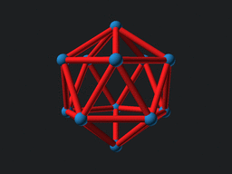
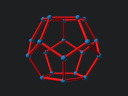
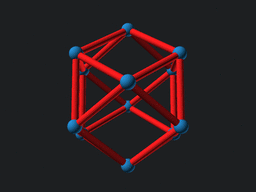
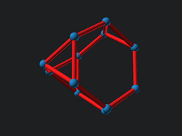
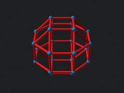
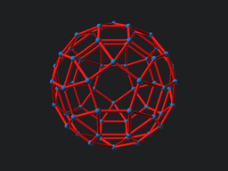
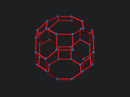

name | .gif
 --- | ---
tetrahedron | 
octahedron | 
hexahedron | 
icosahedron | 
dodecahedron | 
cubeoctahedron | 
truncated_tetrahedron | 
snub_cube | 
rhombicuboctahedron | 
truncated_hexahedron | 
truncated_octahedron | 
icosidodecahedron | 
snub_dodecahedron | 
rhombicosidodecahedron | 
truncated_cuboctahedron | 
truncated_icosahedron | 
truncated_dodecahedron |  
truncated_icosidodecahedron | 
