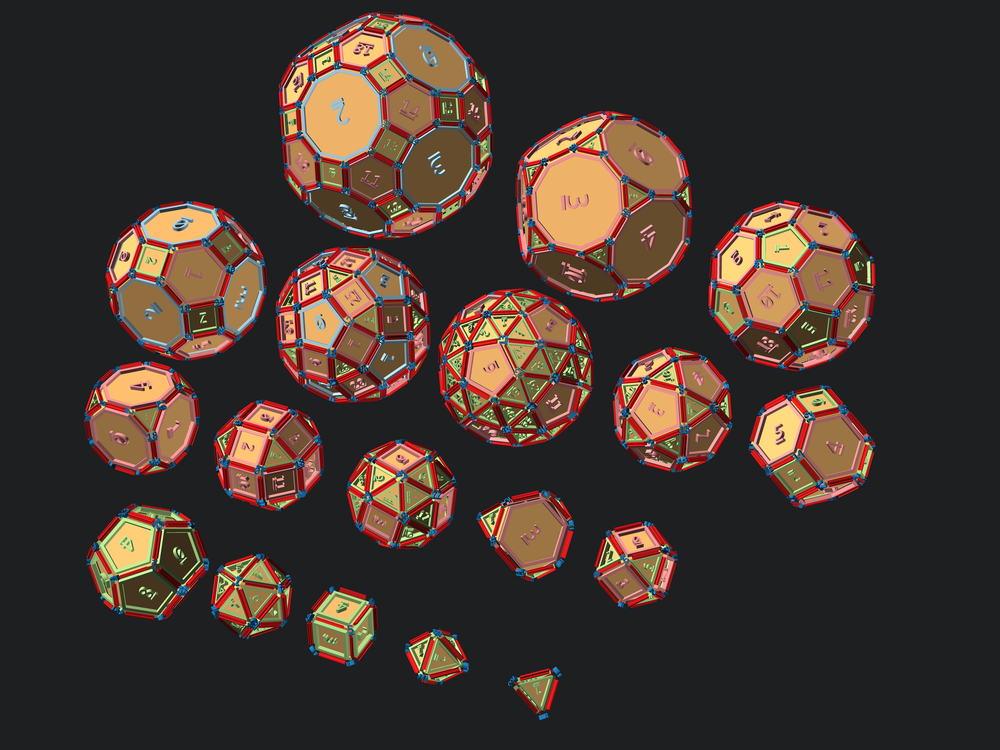

# openscad-polyhedra

The arrays and utility functions included here can be used to place modules coincident with the vertices, edges and faces of the Platonic and Archimedean Solids.

Included polyhedra:
- tetrahedron
- octahedron
- hexahedron
- icosahedron
- dodecahedron
- cubeoctahedron
- truncated_tetrahedron
- snub_cube
- rhombicuboctahedron
- truncated_hexahedron
- truncated_octahedron
- icosidodecahedron
- snub_dodecahedron
- rhombicosidodecahedron
- truncated_cuboctahedron
- truncated_icosahedron
- truncated_dodecahedron
- truncated_icosidodecahedron

Each shape includes an array of vertices, edges, adjacent_vertices, and faces.
Archimedean solids also include separte arrays of faces that are of the same polygon shape.
Example:
- snub_dodecahedron_vertices - an array of 3-vectors
- snub_dodecahedron_edges - an array of 2-tuples containing indexes into the vertices array, one for each edge.
- snub_dodecahedron_adjacent_vertices - an array of arrays, each containing indexes into the vertex array. For examlple, snub_dodecahedron_adjacent_vertices[3] is an array containing the indexes of vertices that are connected to snub_dodecahedron_vertices[3] by an edge.
snub_dodecahedron_triangle_faces and snub_dodecahedron_pentagon_faces contain arrays with indices in the vertex array for each triangular and pentagonal face respectively.
- snub_dodecahedron_adjacent_faces contains all faces.

Usage:
```OpenSCAD
//to arrange modules at vertices
for(i=[0:len(snub_dodecahedron_vertices)-1])
    orient_vertex(
        snub_dodecahedron_vertices[i],
        snub_dodecahedron_vertices[snub_dodecahedron_adjacent_vertices[i][0]]
    )
    //your vertical module centered at the origin here. For example:
    sphere(r=0.2,$fn=64);


//to arrange modules along the edges
for(i=[0:len(snub_dodecahedron_edges)-1])
    orient_edge(
        snub_dodecahedron_vertices[snub_dodecahedron_edges[i][0]],
        snub_dodecahedron_vertices[snub_dodecahedron_edges[i][1]]
    )
    //your vertical module centered at the origin here. For example:
    cylinder(height=1,r=0.1,center=true,$fn=32);


//to arrange modules on the faces
for(i=[0:len(snub_dodecahedron_faces)-1])
    orient_face(
        map_verts(snub_dodecahedron_vertices, snub_dodecahedron_faces[i])
    )
    //your module centered at the origin on the x-y plane here. For example:
    rotate(180/len(snub_dodecahedron_faces[i])-90)
    cylinder(r=0.3,h=0.02,$fn=len(snub_dodecahedron_faces[i]));


//to construct a solid
polyhedron(
    points = snub_dodecahedron_vertices,
    faces = snub_dodecahedron_faces
);
```



### Rotating gifs of each polyhedron
[Index](Index.md)


<p xmlns:dct="http://purl.org/dc/terms/" xmlns:vcard="http://www.w3.org/2001/vcard-rdf/3.0#">
  <a rel="license"
     href="http://creativecommons.org/publicdomain/zero/1.0/">
    
  </a>
  <br />
  To the extent possible under law,
  <a rel="dct:publisher"
     href="https://github.com/benjamin-edward-morgan/openscad-polyhedra">
    <span property="dct:title">Benjamin E Morgan</span></a>
  has waived all copyright and related or neighboring rights to
  <span property="dct:title">openscad-polyhedra</span>.
This work is published from:
<span property="vcard:Country" datatype="dct:ISO3166"
      content="US" about="https://github.com/benjamin-edward-morgan/openscad-polyhedra">
  United States</span>.
</p>
